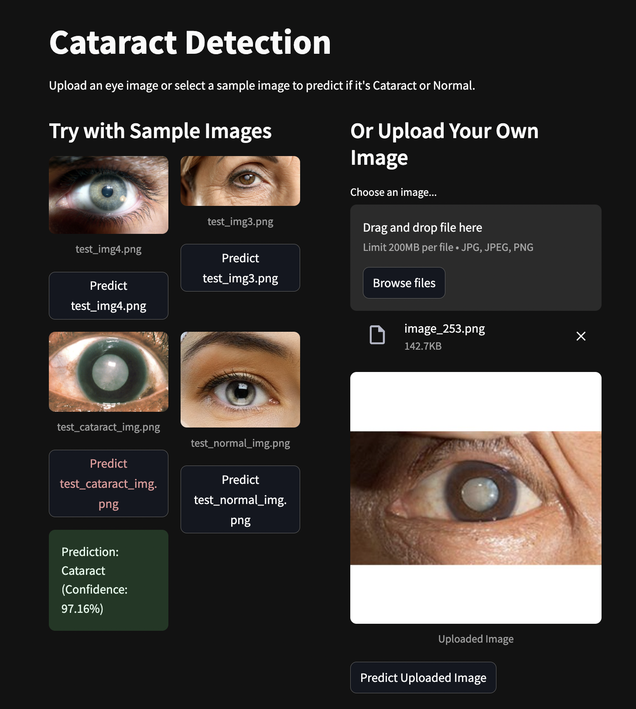
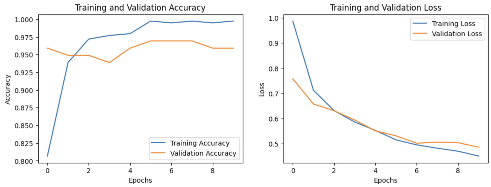
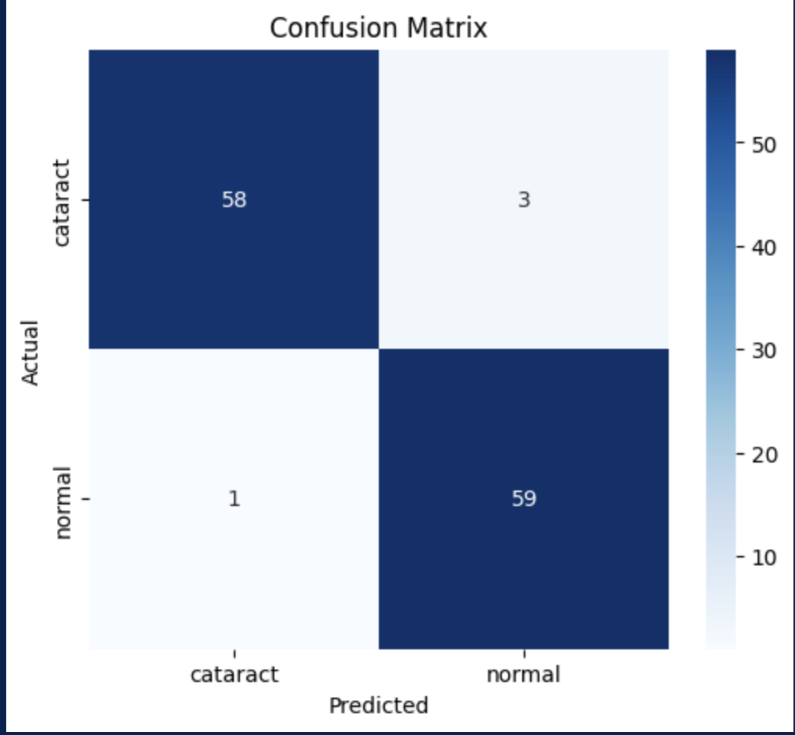
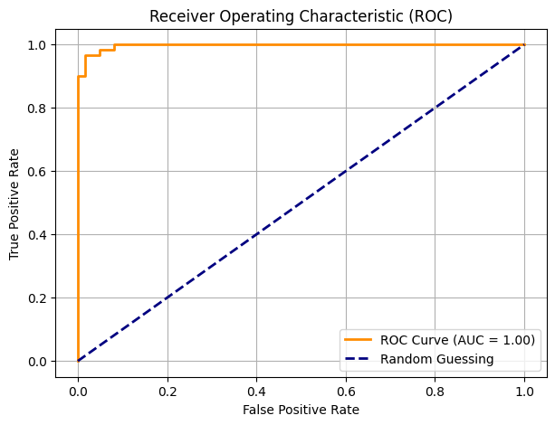

# Cataract-Detection-Binary-Image-Classifier
This project is a deep learning-based solution for classifying eye images into two categories: **Cataract** and **Normal**. It includes data preprocessing, model training using transfer learning, evaluation, and deployment using FastAPI and Streamlit.

---


## 📂 Project Structure

```
├── data/preproceseed_images
│   ├── test/                        # Test images data
|   |      └─cataract/
|   |      └─normal/           
│   ├── train/                       # Train images data
|   |      └─cataract/
|   |      └─normal/     
├── notebooks/
│   ├── datapreprocess.ipynb        # EDA and data preprocessing
│   └── evaluation_test.ipynb       # Model evaluation notebook
├── src/
│   ├── preprocessing.py            # Data augmentation setup
│   └── model.py                    # Model training script
│   └── ml_requirements.txt         # Model training script
├── models/
│   └── best_model_vgg16_v3.h5      # Trained VGG-16 model
├── api/
│   ├── main.py                     # FastAPI app
│   └── streamlit_app.py            # Streamlit frontend
│   └── requirements.txt           # Streamlit frontend
│   └── sample_images/             # Sample test images
```
---

## 📊 Dataset Overview
```bash 
notebooks/data_preprocess.ipynb
```

- **Training Set:** 491 images (`cataract`, `normal`)
- **Testing Set:** 121 images (`cataract`, `normal`)
- Balanced across both classes, but relatively small for typical deep learning.
---

## 🧪 Preprocessing

### EDA
- **Image Thresholding** to segment foreground and background
- **Edge detection** to highlight medical features

### Data Augmentation (`src/preprocessing.py`)
Applied with `ImageDataGenerator`:
- Rotation (±10°), shifts (10%), zoom (±10%)
- Brightness adjustment (±15%)
- Horizontal flip (valid in medical context)
- Rescale pixel values to `[0,1]`
- Train validation split ratio - 0.2
---

## 🧠 Model Training 
```bash 
src/model.py
```

- **Base Model:** VGG16 with transfer learning
- **Fine-tuning:** Last few layers, 10 additional epochs
- **Optimizer:** Adam, LR = 0.0001
- **Callbacks:** Early stopping, model checkpoint
- **Label smoothing** for handling noisy labels

Why VGG16? 
- Pre-trained on ImageNet, has 138M params in total. 
- Useful in medical use cases where data is limited or hard to label.
- Helps it learn low-level features like edges, shapes, and textures, which are often transferable to medical imaging (e.g. eye textures, cloudiness in cataract cases).
- VGG16, when used with transfer learning + data augmentation, performs well even with limited data.


To download the V6G-16 model trained, so as to run for the API: 
- Visit the [Google Drive link](https://drive.google.com/drive/folders/1kNwYlXyL98J1KmRBZ6ihmZdXbCX4l7QY?usp=sharing)
- filename - *best_model_vgg16_v3.h5*
- Make sure to store it in models/ folder path for utilisation.



---

## 📈 Evaluation 
```bash 
notebooks/evaluation_test.ipynb
```

- **Test Accuracy:** 99.95%
- **Precision:** 92.19%
- **Recall:** 98.33%
- **AUC:** 95.04%
- **Optimal Threshold:** `0.65`
  - F1-score: `0.9672`
  - Precision: `0.9516`
  - Recall: `0.9833`
### 📊 Classification Report:
| Class      | Precision | Recall | F1-score | Support |
|------------|-----------|--------|----------|---------|
| Cataract   | 0.98      | 0.95   | 0.97     | 61      |
| Normal     | 0.95      | 0.98   | 0.97     | 60      |
| **Accuracy**   |           |        | **0.97**     | **121**    |
| **Macro Avg** | 0.97      | 0.97   | 0.97     | 121     |
| **Weighted Avg** | 0.97  | 0.97   | 0.97     | 121     |

- **Confusion Matrix:** Very low false positive/negative rates, which is especially important in medical diagnostics. Missing a cataract could be risky, so a high recall is good.
  
  

- **ROC Curve:** The orange curve nearly touches the top-left corner, which means the model is perfectly distinguishing between the classes.
  
  

---

## 🚀 Deployment

### FastAPI Backend 
```bash 
api/main.py
```

- Loads model `models/best_model_vgg16_v3.h5`
- Preprocesses image (resize to 224x224, normalize)
- API Endpoint: `POST /predict/`
- Returns:
  ```json
  {
    "prediction": "Cataract" or "Normal",
    "confidence": 97.98
  }
  ```

### Example cURL
```bash
curl -X 'POST' \
  'http://127.0.0.1:8000/predict/' \
  -H 'accept: application/json' \
  -H 'Content-Type: multipart/form-data' \
  -F 'file=@image_253.png;type=image/png'
```

### Streamlit UI 
```bash 
api/streamlit_app.py
```

- Upload image or test with sample images
- Interacts with FastAPI backend
- Displays prediction label and confidence %

---

## ⚙️ How to Run

### 1. Setup
```bash
cd api/
pip install -r requirements.txt
```

### 2. Run FastAPI Backend
```bash
uvicorn main:app --reload
```
- Visit: [http://127.0.0.1:8000/docs](http://127.0.0.1:8000/docs)
- Click on the POST /predict/ endpoint.
- Click "Try it out".
- Use the "Choose File" button to upload your image (.jpg, .png, etc.).
- Click "Execute" to get the prediction with confidence.

### 3. Run Streamlit Frontend
On another terminal, 
```bash
streamlit run streamlit_app.py
```
- Visit: [http://localhost:8501](http://localhost:8501)
- Click on sample image ‘Predict’ button to see results.
- Or, upload an image of your own from app/samples/ folder, then click ‘Predict Uploaded image’ to see the results - Predicted Class with Confidence%.

---

## 📚 Reference

- [Medical Imaging - Thresholding Techniques](https://pmc.ncbi.nlm.nih.gov/articles/PMC5977656/)
- To know more in detail regarding this project, you can view the **Binary Cataract Classification Documentation.pdf** attached. 

---

## 🏁 Conclusion

This project demonstrates the power of transfer learning and careful preprocessing in tackling medical image classification tasks with limited data, backed by an interactive and robust API + UI pipeline.
